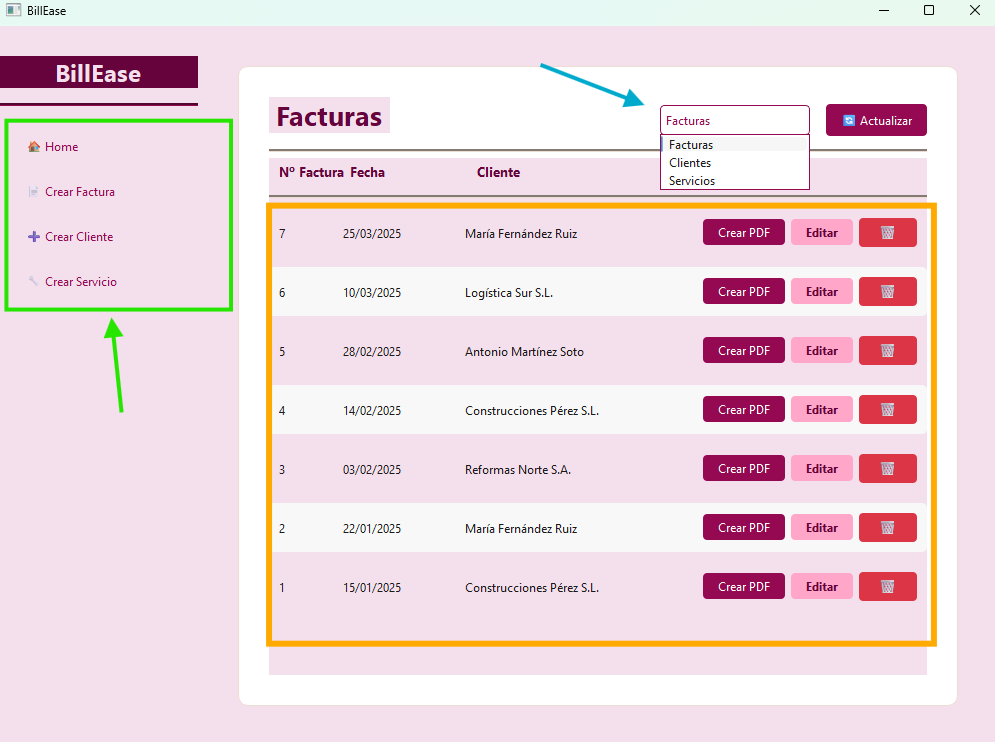
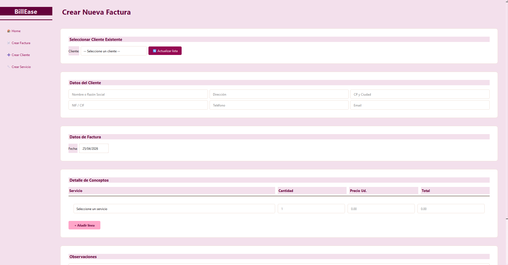
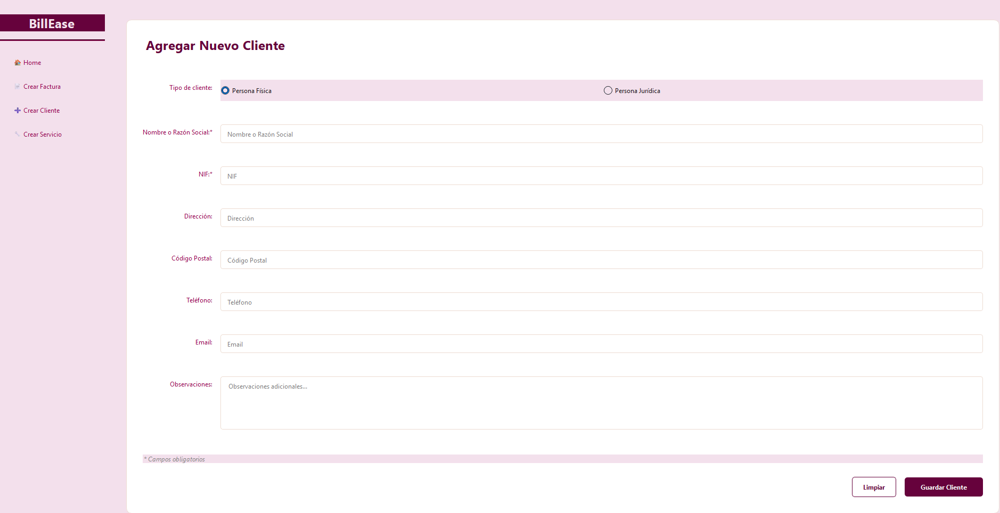

# 🧾 BillEase — Gestión de Facturas para Autónomos

> Aplicación de escritorio sencilla, moderna y pensada para que cualquier autónomo pueda gestionar sus facturas, clientes y servicios sin complicaciones.

---

## 📌 ¿Qué es BillEase?

**BillEase** es una aplicación de escritorio desarrollada en **Python** con interfaz gráfica **PyQt6** y base de datos **SQLite**.

Está diseñada para autónomos que necesitan una herramienta ligera y fácil de usar para:

- Registrar y gestionar sus clientes
- Crear y editar facturas profesionales
- Mantener un catálogo de servicios con precios
- Exportar facturas en formato **PDF** listas para enviar

No requiere conexión a internet, ni servidores externos. Todo queda guardado localmente en tu ordenador.

---

## 💻 Requisitos del sistema

| Requisito | Versión mínima |
|-----------|---------------|
| Python    | 3.10 o superior |
| Sistema operativo | Windows, macOS o Linux |

---

## ⚙️ Instalación

### 1. Clona el repositorio

```bash
git clone https://github.com/Kronos8610/BillEase.git
cd BillEase
```

### 2. Crea el entorno e instala las dependencias

```bash
python -m venv .venv
.venv\Scripts\activate        # Windows
source .venv/bin/activate      # macOS / Linux

pip install -r requirements.txt
```

> Las versiones están fijadas en `requirements.txt`. SQLite viene incluido con Python.

### 3. Ejecuta la aplicación

```bash
python main_start.py
```

La primera vez que arranques la aplicación, se mostrará un formulario de **configuración inicial** donde introducirás tus datos como autónomo (nombre, NIF, dirección, etc.). Esta información aparecerá en todas tus facturas.

### ¿Dónde se guardan los datos?

La base de datos vive en la carpeta de datos de tu usuario, no junto al programa:

| Sistema | Ruta |
|---------|------|
| Windows | `%LOCALAPPDATA%\BillEase\billease.db` |
| macOS | `~/Library/Application Support/BillEase/billease.db` |
| Linux | `~/.local/share/BillEase/billease.db` |

Así la aplicación encuentra tus datos la abras desde donde la abras. Si vienes de una
versión anterior, el `BillEase.db` que tuvieras junto al programa se traslada solo la
primera vez (el original se conserva renombrado, no se borra).

Al arrancar se aplican las **migraciones** pendientes, guardando antes una copia de
seguridad con la fecha en el nombre. La variable de entorno `BILLEASE_DB` permite apuntar
a otro fichero, útil para pruebas.

---

## 🗂️ Base de datos de prueba (opcional)

La base de datos **no se versiona**: es un fichero de trabajo, y además guardaría tus
datos reales en el repositorio. Si quieres probar el programa con contenido, genera una
base de demostración con datos ficticios:

```bash
python tools/seed_demo.py
```

Crea la base con 5 clientes, 8 servicios y 7 facturas. Para empezar de cero, borra
el fichero y arranca la aplicación: te pedirá tus datos de autónomo.

Las credenciales de la base de demostración son:

| Campo | Valor |
|-------|-------|
| **Email** | carlos.garcia@billease.es |
| **Contraseña** | Pass1234 |

---

## 📸 Captura de pantalla



> **Descripción de la interfaz:**
>
> - **Caja y flecha verde** — Menú de navegación lateral con las secciones principales: Home, Crear Factura, Crear Cliente y Crear Servicio.
> - **Caja naranja** — Tabla principal de facturas, donde se listan todos los registros con sus acciones disponibles: Crear PDF, Editar y Eliminar.
> - **Flecha azul/turquesa** — Desplegable de navegación que permite cambiar la vista entre Facturas, Clientes y Servicios.

---


## 🚀 ¿Qué incluye la aplicación?

### 🏠 Panel principal
Vista general con listado de facturas, clientes y servicios. Permite eliminar registros y acceder rápidamente a todas las funciones.

### 📄 Crear factura
Formulario completo para crear facturas. Selecciona un cliente existente y **escribe
cada concepto**: la descripción entera del trabajo, su cantidad, su unidad (ud, h, m²…)
y su precio. El total se calcula mientras escribes, con IVA desglosado. No hay catálogo
que rellenar antes: el programa sugiere lo que ya has escrito otras veces, pero nunca
obliga a elegir de una lista.



### 👤 Crear cliente
Registro de clientes con soporte para **persona física** (NIF) y **persona jurídica** (CIF), con validación automática del formato fiscal español.



### 📝 Presupuestos
Presupuestos con su propia serie (`P-2025-001`), fecha de validez y estados
—borrador, enviado, aceptado, rechazado—. Un presupuesto aceptado se convierte en
factura con un clic: copia los conceptos y le asigna su número de la serie de
facturación.


### ✏️ Editar factura
Permite modificar cualquier factura existente: cambiar el cliente, las fechas, los conceptos y las cantidades.

### 📥 Exportar a PDF
Genera un PDF profesional de cualquier factura con los datos del emisor, del cliente, el desglose de conceptos, subtotal, IVA (21%) y total.

---

## 🗃️ Estructura del proyecto

```
BillEase/
├── main_start.py        # Punto de entrada de la aplicación
├── requirements.txt     # Dependencias con versiones fijadas
├── tools/               # Utilidades de desarrollo
│   ├── seed_demo.py     # Genera una base de datos de demostración
│   ├── baseline.py      # Congela el inventario de referencia
│   ├── verify.py        # Verifica los invariantes de la base
│   └── inventario.py    # Lectura del inventario (compartido)
├── docs/                # Auditoría, rediseño y ruta de trabajo
├── tests/               # Pruebas automáticas
├── core/                # Dominio: sin Qt y sin SQL
│   ├── models.py        # Documento, Linea, Cliente, Autonomo
│   ├── money.py         # Aritmética con Decimal
│   ├── taxes.py         # Base, IVA y total: el único cálculo
│   ├── numbering.py     # Serie fiscal por ejercicio
│   ├── quotes.py        # Presupuestos y su conversión en factura
│   ├── fechas.py        # ISO en la base, formato español en pantalla
│   ├── security.py      # Contraseña cifrada con Argon2
│   └── validators/      # NIF, NIE, CIF, teléfono, CP
├── data/                # Único sitio con SQL
│   ├── connection.py    # Una conexión, con claves ajenas activadas
│   ├── schema.py        # Esquema de partida
│   ├── migrations/      # 001 … 008
│   └── repositories/    # documentos, clientes, autonomo
├── documents/
│   └── invoice_pdf.py   # Factura y presupuesto, sin Qt
├── ui/                  # Pantallas
│   ├── aplication.py    # Ventana principal y menú lateral
│   ├── login_ui.py      # Registro inicial del autónomo
│   ├── homePage.py      # Listado de documentos y clientes
│   ├── crearCliente.py  # Formulario de nuevo cliente
│   ├── views/           # documento_editor.py (facturas y presupuestos)
│   └── widgets/         # concepto.py (el campo con sugerencias)
└── utils/
    └── globals.py       # Colores y fuentes globales de la interfaz
```

---

## 🛠️ Tecnologías utilizadas

| Tecnología | Uso |
|------------|-----|
| **Python 3** | Lenguaje principal |
| **PyQt6** | Interfaz gráfica de escritorio |
| **SQLite** | Base de datos local |
| **ReportLab** | Generación de PDFs |

---

## 🧰 Desarrollo

```bash
python tools/seed_demo.py                 # base de demostración con datos ficticios
python tools/seed_demo.py --sin-migrar    # …en el esquema original, para probar migraciones
python -m data.migrations --dry-run       # qué migraciones faltan
python -m data.migrations                 # aplicarlas (deja copia de seguridad)
python tools/verify.py --totales --post-migracion
pytest                                    # pruebas automáticas
```

`tools/verify.py` compara la base contra `tests/fixtures/baseline.json` y devuelve 0 si
todo está en verde. Es la puerta de verificación que usa cada fase del plan de trabajo.

**Documentación técnica** — en [`docs/`](docs/):

| Documento | Contenido |
|---|---|
| [`ANALISIS.md`](docs/ANALISIS.md) | Auditoría del código: 16 defectos verificados |
| [`RUTA.md`](docs/RUTA.md) | Plan de trabajo en 7 fases con sus verificaciones |
| [`rediseno-fluent.html`](docs/rediseno-fluent.html) | Propuesta de rediseño de la interfaz |

---

## 🔮 Futuras mejoras

> Estas mejoras están planificadas y ordenadas en [`docs/RUTA.md`](docs/RUTA.md).

Estas son algunas funcionalidades que se plantean incorporar en próximas versiones de BillEase:

### 🔒 Seguridad y cifrado de datos
- Cifrado de la base de datos local para proteger los datos sensibles de los clientes (nombre, NIF/CIF, email, teléfono)
- Almacenamiento seguro de la contraseña del autónomo mediante hash (bcrypt)
- Protección contra accesos no autorizados a los archivos de la aplicación

### 🔍 Búsqueda y filtros
- Buscador en tiempo real para facturas, clientes y servicios
- Filtros por fecha, importe, estado o tipo de cliente
- Ordenación de columnas en las listas del panel principal

### 🎨 Personalización de la interfaz
- Apartado de **ajustes de tema**: modo claro, modo oscuro y selección de color de acento
- Posibilidad de cambiar el tamaño de fuente de la aplicación
- Guardado automático de las preferencias visuales del usuario

### 👤 Ajustes de usuario
- Pantalla de **perfil del autónomo** para modificar los datos personales (nombre, dirección, NIF, teléfono, email) sin necesidad de reinstalar
- Cambio de contraseña desde la propia aplicación
- Subida de logotipo propio para que aparezca en los PDFs generados

### 📊 Estadísticas e informes
- Panel de estadísticas con gráficos de ingresos por mes
- Resumen anual de facturación para facilitar la declaración de impuestos
- Exportación de informes en Excel o CSV

### 📄 Mejoras en la generación de PDF
- Plantillas de diseño seleccionables para las facturas
- Inclusión del logotipo del autónomo en la cabecera
- Numeración automática de facturas con formato personalizable (ej: `2025-001`)
- Campo de número de cuenta bancaria para incluirlo en la factura

### 📧 Envío de facturas
- Envío directo de facturas por email desde la aplicación
- Historial de facturas enviadas por correo

### 🗄️ Gestión avanzada de datos
- Sistema de copias de seguridad automáticas de la base de datos
- Posibilidad de marcar facturas como **pagadas / pendientes / vencidas**
